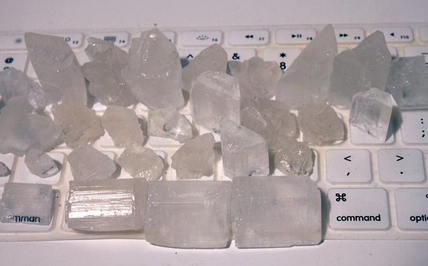

	<!-- 

 -->
	

	

	

<h4>Crystal Keyboard, CCPM</h4>

2013

CCPM proposes an alternative way of looking at the way we use the devices we rely on the most. What if the the energy we expend and “waste” can be harvested and stored into a battery for later use? Could these typing-powered batteries then be treated as designed objects with their own narratives and sentimental purposes?

We spend increasingly more time on the computer across the globe, using the keyboard as one of the main modes of interaction between ourselves and the rest of the world. CCPM proposes an alternative way of looking at the way we use the devices we rely on the most. What if the the energy we expend and “waste” can be harvested and stored into a battery for later use? Could these typing-powered batteries then be treated as designed objects with their own narratives and sentimental purposes?
