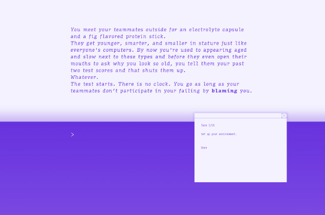
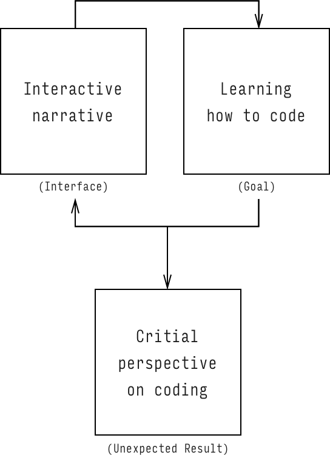

Example of the interface

Diagram

<h4>New Mercy Park</h4>

2016

New Mercy Park is a transmedia educational tool that is part narrative experience, part alternate reality game, part poetry, and part software tutorial, resulting in an experience that spans months and takes place across chat boxes, emails, and other internet platforms.

Its my continued research into the potential for the web browser as an interface layer for performance and theater. Ever since the age of AOL CD-roms, I have been participating in the crafting of stories threading through email chains, chatrooms, and instant messages. And partially inspired by Neal Stephenson's <em>The Diamond Age: Or, A Young Lady’s Illustrated Primer an imperiled future Earth</em>.

<!-- > The book spoke in a lovely contralto, with an accent like the very finest Vickys. The voice was like a real person’s—though not like anyone Nell had ever met. It rose and fell like siow surf on a warm beach, and when Nell closed her eyes, it swept her out into an ocean of feelings.

> Once upon a time there was a little Princess named Nell who was imprisoned in a tall dark castle on an island in the middle of a great sea, with a little boy named Harv, who was her friend and protector. She also had four special friends named Dinosaur, Duck, Peter Rabbit, and Purple. Princess Nell and Harv could not leave the Dark Castle, but from time to time a raven would come to visit them . . .

>“ What’s a raven?” Nell said.
The illustration was a colorful painting of the island seen from up in the sky. The island rotated downward and out of the picture, becoming a view toward the ocean horizon. In the middle was a black dot. The picture zoomed in on the black dot, and it turned out
 86 to be a bird. Big letters appeared beneath. “R A V E N,” the book said. “Raven. Now, say it with me.”

 > “The Illustrated Primer is an extremely general and powerful system capable of more extensive self-reconfiguration than most. Remember that a fundamental part of its job is to respond to its environment. If the owner were to take up a pen and write on a blank page, this input would be thrown into the hopper along with everything else, so to speak.”
 -->
