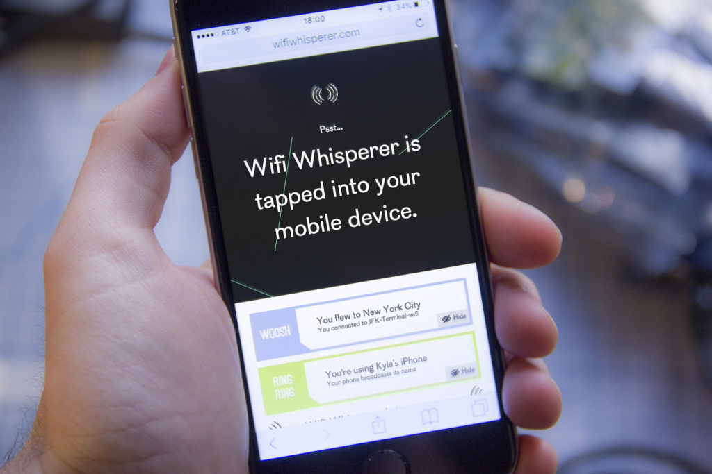

<h4>Wifi Whisperer</h4>

2016

Site and logo design for Kyle McDonald's installation at Moogfest. Wifi Whisperer collected data from thousands of devices: what kind of device, what networks they've been connected to, which websites they visit, even the remaining battery life.

Project featured on <a href="http://www.wired.com/2016/06/wifi-whisperer-stalks-phones-data-creepiest-way-possible" alt="‘Wifi Whisperer’ Siphons Your Data in the Creepiest Way Possible" target="_blank">Wired</a> and <a href="www.coolhunting.com/design/kyle-mcdonald-wifi-whisperer-installation-moogfest-2016" alt="Wifi Whisperer at Moogfest 2016" target="_blank">Cool Hunting</a>.

<em>Photos courtesy of Kyle McDonald.</em>

