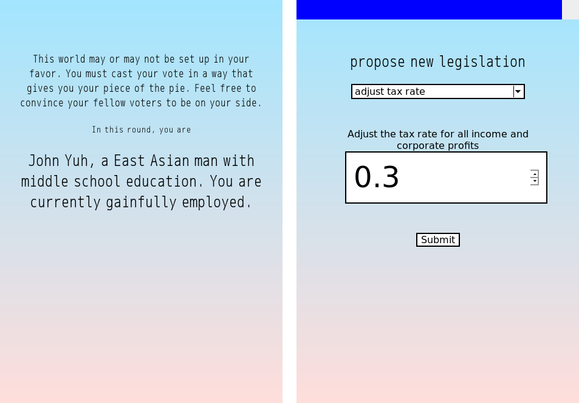

<h4>Humans of Simulated New York</h4>

2016

HOSNY is a participative agent-based simulation built to speculate alternative economies. It asks how world-building as interactive gameplay creates the opportunity for a better and more complete understanding of the complex relationships that make up the systems of our world.

Players set up the world according to their preferences and the virtual city of New York is filled up with simulated citizens based on the U.S. Census data. Players have the chance to steer the future of the city through a gamified version of democracy: players take turns voting on important issues at the end of each play session.

Completed at <a href="https://www.dbrslabs.com/" target="_blank">DBRS Innovation Labs</a> with <a href="http://frnsys.com/" target="_blank">Francis Tseng</a>.

